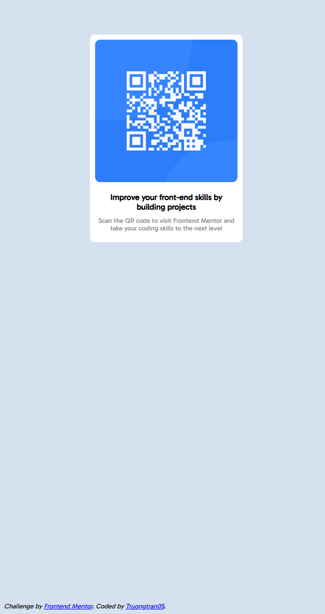
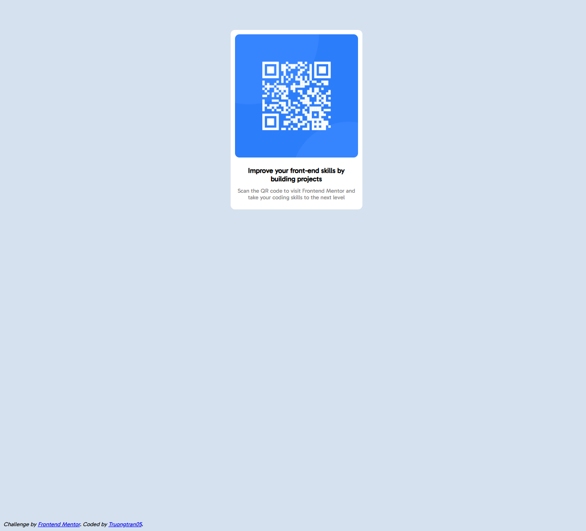

# Frontend Mentor - QR code component solution

This is a solution to the [QR code component challenge on Frontend Mentor](https://www.frontendmentor.io/challenges/qr-code-component-iux_sIO_H). Frontend Mentor challenges help you improve your coding skills by building realistic projects. 

## Table of contents

- [Overview](#overview)
  - [Screenshot](#screenshot)
  - [Links](#links)
- [My process](#my-process)
  - [Built with](#built-with)
  - [What I learned](#what-i-learned)
  - [Continued development](#continued-development)
  - [Useful resources](#useful-resources)
- [Author](#author)
- [Acknowledgments](#acknowledgments)

## Overview

### Screenshot


Mobile design


PC_design

### Links

- Solution URL: [https://github.com/Truongtran05/QRproject](https://github.com/Truongtran05/QRproject)
- Live Site URL: [https://truongtran05.github.io/QRproject/](https://truongtran05.github.io/QRproject/)

## My process

### Built with

- Semantic HTML5 markup
- CSS custom properties
- Flexbox
- CSS Grid
- Mobile-first workflow

### What I learned

I learned how to use some CSS layout such as CSS grid, CSS flex box and how to use media query for responsive design. Besides, I learned to use fonts from Google fonts using html link tag.

```html
    <link href="https://fonts.googleapis.com/css2?family=Gabarito&display=swap" rel="stylesheet">
```
```css
@media(max-width: 300px){
    .grid-container{
        display: grid;
        grid-template-columns: 1fr 200px 1fr;
    }
}
```

```css
.grid-container{
    display: grid;
    grid-template-columns: 1fr 300px 1fr;
    grid-template-rows: 1fr 1fr;
}
```

### Continued development

I plan to learn more about responsive design using Javascript.

## Author

- GitHub - [Truongtran05](https://github.com/Truongtran05)
- Frontend Mentor - [Truongtran05](https://www.frontendmentor.io/profile/Truongtran05)

